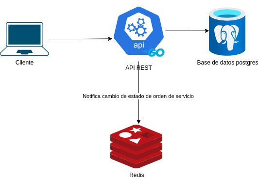
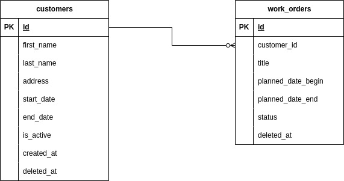

# API REST para gestionar ordenes de servicio y clientes

Mediante esta implementación se realiza una api rest para gestionar clientes y ordenes de servicio. Se utiliza Golang para el desarrollo de la API REST, Postgres como motor de base de datos y Redis para notificar cuando una orden de servicio es finalizada.

En la siguiente captura se puede visualizar la arquitectura implementada:

La siguiente captura muestra el diagrama de base de datos utilizado:

## Ejecución de la API REST

Este proyecto funciona con `Docker` por lo que es la única dependencia que se requiere tener instalada.

Para arrancar ejecutar la API REST se deben realizar los siguientes pasos:

1. Crear un archivo con nombre `.env` en la raíz del proyecto
2. Copiar el contenido del archivo `.env.example` que se encuentra en la raíz del proyecto
3. Ejecutar el comando `docker compose up` estando en la raíz del proyecto
4. Verificar la documentación de la API que se puede encontrar en la ruta `http://localhost:{APP_PORT}/swagger/index.html` (tenga en cuenta que {APP_PORT} se debe cambiar por el puerto de la aplicación configurado en el archivo `.env`)
5. Finalmente teniendo en cuenta la documentación puede probar la API rest por medio de algún cliente que le permita realizar peticiones

